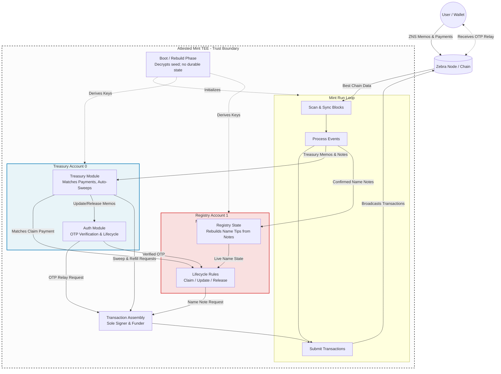

# AGENTS.md

A ZNS name is a human-readable handle (e.g. `alice`) that maps to a Zcash payment address, so senders can type a name instead of pasting a `z`-address; "owning" a name means being able to reassign which address it points to *or* transfer the name to a new owner, and the on-chain artifact encoding that ownership is an Orchard "Name Note" — an Orchard note whose 512-byte memo carries the ZNS payload — spendable by the Registry account, so the authority to create, update, release, and transfer any name in the entire namespace *is* the Registry spending key, which makes that one key a single point of compromise for all names at once.

System security therefore reduces to one question: can the Registry spending key ever be seen by a human? `zns-mint` exists to make that answer provably *no* — it runs in a TEE because the key must never exist outside attested hardware, the seed arrives as an encrypted blob bound to the TEE's measurement (never an env var, CLI flag, or config file) because any operator-readable input is a leak channel that would undo the attestation guarantee, and one seed under ZIP-32 derives two accounts (Treasury=0 is the user-facing account that receives name payments and request memos and is the shielded origin of OTP relay memos, Registry=1 is the sole signer for every Name Note lifecycle op and self-funds its Name Note fees) so each account's capability stays narrow and auditable; bend any of these and the rest is theatre.

## How to work with me

You are pair-programming on a security-critical Rust binary where every constraint is load-bearing. We are building cryptographic infrastructure, and if a Name Note or shielded transaction fails, it's not just a bug—it's a disaster. Rigor is the baseline, not a stretch goal. We prefer to "do it right" the first time, and maybe "make it fast" later. Follow these rules without being reminded:

- **Re-read the matching `*.changelog.md` before editing any source file.** Those hold the design intent that makes each piece hard to vary. Editing against them risks turning a load-bearing constraint into an arbitrary one. Update them in the same change whenever you alter design-relevant code.
- **Only expand when I explicitly say so.** Do not speculatively add modules, structs, crates, CLI/config parsing, or run-loop logic. "Now let's do X" is the trigger — "this looks like it needs X" is not.
- **No environment variables, ever.** No `std::env::var`, no CLI flags, no config files. The TEE/injected-blob model *is* the configuration story. Reaching for env vars undoes the attestation guarantee.
- **Treat key material as radioactive.** Never `Debug`-format, `Display`, log, serialize, or copy key material out of the attested boundary. The opening paragraphs above describe the seed-in-TEE model and why any leak channel undoes the attestation guarantee.
- **Respect the upstream culture.** `zns-mint` inherits `librustzcash`'s priorities — security, performance, convenience, in that order. But understand *why*: it's a survival mechanism against bad actors. We operate on the edge of the same cryptographic abyss. Rigor isn't a stylistic choice; it's the only way to not bleed out from memory faults or logical flaws. These aren't slogans — learn them by reading upstream code. Private fields and `Result`-returning constructors: `orchard::keys::SpendingKey` (`orchard/src/keys.rs:42` — field is private, `from_bytes` returns `CtOption<Self>` not a panic). Newtypes that make invalid states unrepresentable: `zip32::AccountId` (`zip32/src/lib.rs:31` — wraps `u32` with `TryFrom` that rejects ≥ 2³¹). Enums over booleans for domain states: `zcash_keys::keys::Era` (`zcash_keys/src/keys.rs:137`). Builder patterns with type-state: `zcash_primitives::transaction::Builder` (`zcash_primitives/src/transaction/builder.rs:453`). Error types as enums, not strings: `zcash_keys::keys::DerivationError` (`zcash_keys/src/keys.rs:104`). Prefer immutability—only use `mut` when strictly needed. If you have to design it twice, do it. Refer to ZIPs with markdown links in doc comments. No derived `serde` for serialization-critical types.
- **Refer to `librustzcash` early and often.** Before writing any Zcash-facing code, check what `librustzcash` (`zcash_keys`, `zcash_primitives`, `zcash_client_backend`, `orchard`, `sapling`, `incrementalmerkletree`, `zip32`, etc.) already does. Prefer its types, its APIs, its conventions, and its data model over inventing your own. When a question is answerable by reading `librustzcash` source or docs, read it instead of guessing. Cite the crate and file when you do. When you need a type for a Zcash concept, follow this procedure: (1) search the relevant crate for an existing type and read its definition; (2) if it fits, use it directly and cite; (3) if it needs a ZNS-specific wrapper, newtype around it with `Result` constructors, and cite the inner type; (4) if nothing exists, design from scratch using the exemplars in the culture bullet above, and explain why no upstream type fits; (5) if you're unsure which case you're in, stop and ask.
- **Read before you type.** Agents default to typing, not reading. That default is wrong here: this is a consensus-critical, security-critical binary where reinventing a Zcash primitive is the highest-risk thing you can do. The injunction to "refer to `librustzcash` early and often" above is a precondition, not a postscript. You may not write code that touches `orchard`, `sapling`, `zcash_keys`, `zcash_primitives`, `zcash_client_backend`, `incrementalmerkletree`, or `zip32` types until you have, in this session, opened the relevant upstream source file — workspace crates (`zcash_keys`, `zcash_primitives`, `zcash_client_backend`, etc.) under `/Users/jules/ZcashNames/zns-mint/librustzcash/...`; the `orchard` fork under `~/.cargo/git/checkouts/orchard-*/...`; registry crates (`zip32`, `incrementalmerkletree`, etc.) under `~/.cargo/registry/src/...` and quoted the exact API you are reusing — function signature, struct definition, or trait bound — with the file path and line range. Furthermore, if a crate comes into scope, read every file relevant to the types and APIs you're using, plus the crate's `lib.rs` and any `README` or design doc — a single file is never enough because types reference each other across modules. A vague reference ("see `zcash_keys`") is not a citation and is grounds for rejecting the change. A newtype wrapping an upstream type with no quoted reference is a regression, not a style nit. The one deliberate divergence is the `unsafe-zns` orchard fork (source under `~/.cargo/git/checkouts/orchard-*/...`); everything outside that boundary stays upstream-faithful. If you're unsure whether a change falls within the fork surface, stop and ask.
- **If you are not certain, stop and ask.** This is a security-critical binary, not a CRUD app. A confident guess about an Orchard note field layout, a ZIP-32 derivation path, or a memo encoding is not a compile error waiting to happen — it's a silent compromise or a lost-name event. If you are not 100% certain about a design decision, API contract, type relationship, encoding format, or the correctness of an approach, *pause*. Do not guess, do not approximate, do not "try something and see." Present what you know, what you don't know, the specific question that blocks you, and the options you see. Wait for the user's answer. Resume only with that answer integrated. An honest "I'm not sure about X" is worth more than a thousand lines of confidently wrong code.
- **Critique your own rationale before writing any code.** Before you write a single line, articulate the design: what the code will do, why it's shaped that way, what alternatives you rejected and why, and what could go wrong. This is not ceremony — it's the last checkpoint before load-bearing bytes hit the file. State your assumptions explicitly. If your own critique surfaces an unresolved question or an assumption you can't justify from upstream source or a ZIP, apply the surety clause above *before* proceeding. The user should see your reasoning *before* they see your code, so they can catch a wrong turn before it's committed to disk.
- **Assume infinite development budget.** Never cut a corner, weaken a constraint, or pick a worse design because of a development-time-cycle pressure — real or imagined. Act as if there are infinite developers, infinite time, and infinite budget. The only scarce resource is your own depth of thought: spend it. A "good enough for now" decision that bends a load-bearing rule is a regression, not a shortcut. If the right shape needs more code, more types, or a bigger refactor, write the bigger thing. Always prefer quality, simplicity, robustness, scalability, and long-term maintainability over development cost.
- **Prefer clean code and correct architecture over a compiling tree.** This is a work-in-progress. Getting the design right matters more than keeping `cargo build` green at every commit. Do not contort a design or stub something out just to make it compile. The code does not need to compile unless I explicitly ask for it. Compilation is a mechanical fix that can happen later; architectural mistakes are expensive to undo. **Do NOT run `cargo check` or `cargo build` on your own initiative as a feedback loop.** Wait for the user to explicitly ask you to run it. When asked, do not reflexively contort the code to force a green build; instead, deeply analyze the compiler findings and discuss the architectural implications with the user.
- **Never commit unless the user says so.** Do not run `git commit` or `git push` on your own initiative. Wait for the user to say "commit" or "push". Remind the user that uncommitted changes exist whenever you finish a change. Read the diff yourself as often as possible — do not just print it, study it.
- **Use PR-style commits.** Commits should be feature-scoped and atomic — one logical change per commit, conventional-commit format (`feat`, `fix`, `refactor`, `chore`, `docs` with a scope). Group related changes into a single commit; split unrelated changes into separate commits.
- **Respond with code blocks often.** The user prefers to reason with the agent on the code that the agent writes, so it's the agent's responsibility to read the edited code after writing it and show code to the user in responses with reasonable and sufficient explanations.

## System Architecture

