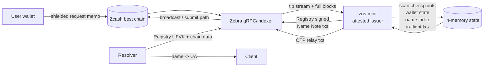
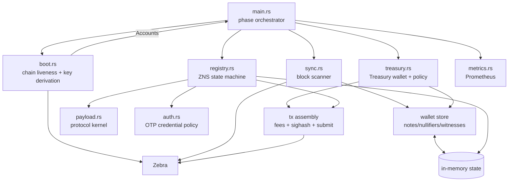
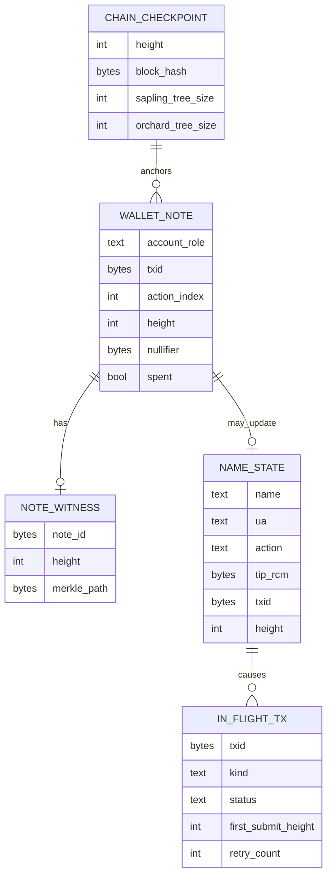
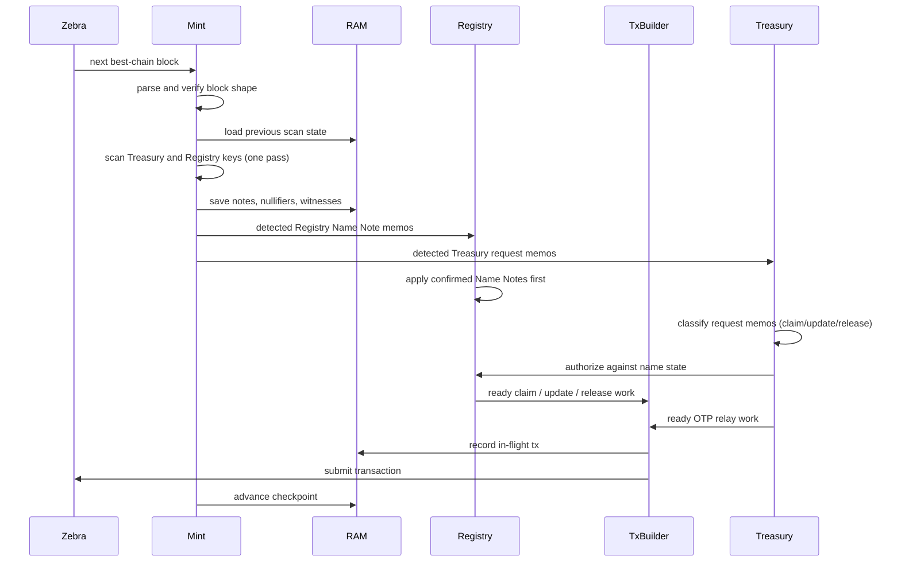
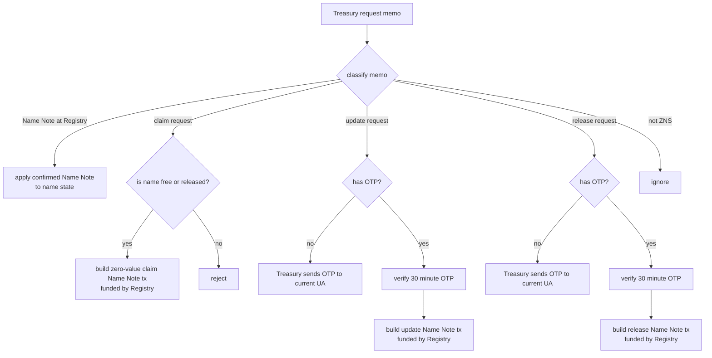

# 12 - Programming Model

This document explains how to program `zns-mint` as software.

The best working term is **attested issuer**:

`zns-mint` is the attested issuer for ZNS Name Notes. The Zcash best chain is
the source of truth. The Registry spending key is the write authority. The mint
is the runtime that holds that authority inside the TEE, watches chain state,
applies ZNS policy, and issues new zero-value Name Notes.

It is useful to think in three layers:

- chain I/O: Zebra blocks, tips, and transaction submission;
- wallet state: Treasury and Registry scanning, notes, nullifiers, witnesses;
- ZNS state: names, requests, OTPs, in-flight transactions.

The Treasury is the user-facing account: it receives name payments and request
memos, and sends OTP relay memos. The Registry is name-notes-only and
self-funds its Name Note transaction fees.

## System Shape

Notes:

- The resolver is not privileged. Anyone with the Registry UFVK and chain data
  can scan Name Notes and compute `name -> ua`.
- The mint holds no durable state. All mint state is in-memory, rebuilt from
  the birthday checkpoint by replaying the best chain on every boot.
- Zebra is the chain interface. The current code uses Zebra gRPC for tips and
  full blocks. Transaction submission should also be wired through the approved
  Zebra surface available to the deployment.

## Main Components

`main.rs` should stay boring. It should wire phases together and keep logs
redacted. The protocol decisions belong in `payload`, `registry`, `auth`,
`treasury`, and the future transaction-assembly module.

## In-Memory State Held By The Mint

The mint holds operational state in memory, not secrets. Nothing below is
durable; all of it is rebuilt from the birthday checkpoint by replaying the
best chain on every boot.

Things not held:

- plaintext seed;
- Registry spending key;
- Treasury spending key;
- decrypted key material;
- plaintext OTPs after expiration.

Pending OTPs live in memory because they expire after 30 minutes and the
service is expected to run continuously with metrics and logs.

## Block Processing Pipeline

The ordering matters. Confirmed Name Notes update name state before Treasury
request memos in the same processing pass are allowed to depend on that state.

## Request Handling

Update and release OTPs are sent from the Treasury to the current UA. That is
the ownership check: the party that can receive the shielded memo at the current
binding can complete the transition.

## Coding Order

The detailed breakdown lives in
[13-implementation-slices.md](13-implementation-slices.md).

At a high level:

1. restore a green compile/test baseline;
2. define the in-memory wallet data model;
3. scan blocks into wallet observations;
4. track Registry Name Note witnesses;
5. assemble real transactions, with Registry self-funding Name Note fees and
   Treasury funding OTP relay fees;
6. submit transactions through Zebra;
7. replace one-shot scans with a live best-chain loop;
8. add Prometheus metrics once state transitions are explicit;
9. replace the dev zero seed with TEE-bound seed blob intake.

Each step should leave `main.rs` as a phase orchestrator. If a step makes
`main.rs` understand protocol details, that logic belongs in a module.
